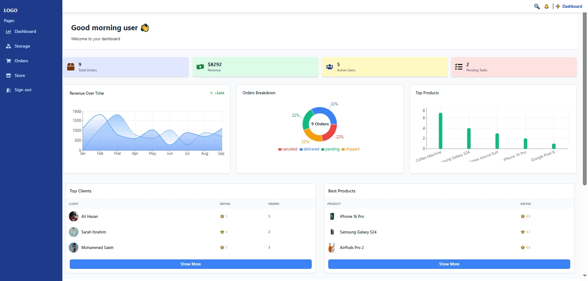

# 🛍️ PrimeMart — Modern Ecommerce Web App

Welcome to **PrimeMart**, a sleek and responsive **React + Firebase + Stripe** e-commerce web app that brings a realistic online shopping experience to life.  
It includes user and admin panels, live order tracking, charts, CRUD features, and a secure checkout system.

## 🔑 Demo Accounts

Use these credentials to explore the full platform:

| Role | Email | Password |
|------|--------|-----------|
| 🧑‍💼 **Admin** | admin@gmail.com | 123456 |
| 🛍️ **User** | test@gmail.com | 123456 |

> 🛒 **Cart** can't be used without login.  
> 🔑 Use the **admin login** to access the dashboard, manage orders, and view charts.

🌐 **Live Demo:** [primemartm.netlify.app](https://primemartm.netlify.app)

---





---

## 🚀 Features

### 🛍️ Storefront
- 🏠 **Home Page** with featured categories and product sections  
- 🔍 **Product Details** and quick view popups  
- 💾 **Persistent Cart** using LocalStorage (works even without login)  
- 🔢 **Dynamic pricing** (auto updates by RAM & storage)  
- 🧭 **Search & Filters** by category and price  
- 💳 **Stripe Checkout** integration  
- 🖼️ **Lazy image loading** for fast performance  

### 🧑‍💼 Admin Panel
- 🔐 **Firebase Authentication** (User & Admin)  
- 📦 **CRUD Operations** — Add, edit, delete products  
- 📊 **Analytics Dashboard** — 3 charts using *Recharts*  
- 🧾 **Orders Management** — Update order status (pending, shipped, completed)  
- 🗂️ **Firestore Integration** for real-time data  

---


## 🧰 Tech Stack

| Category | Technologies |
|-----------|---------------|
| Frontend | React.js, React Router |
| Backend | Firebase Auth & Firestore |
| Payment | Stripe Checkout |
| Charts | Recharts |
| Styling | Custom CSS |
| Storage | LocalStorage |
| Icons | React Icons |

---

## 🧪 Run Locally

```bash
git clone https://github.com/Mousacr7/primemart.git
cd primemart
npm install
npm start
Then open 👉 http://localhost:3000

👨‍💻 Author
Musa Mlam Al Brnawi
Frontend Developer — React.js | Firebase | Stripe
📫 [Fiverr](https://www.fiverr.com/users/musa_abubakar) 

💡 Passionate about crafting modern web apps with clean design and smooth UX.

🪪 License
Free for educational and portfolio use.
© 2025 PrimeMart — Created by Musa Mlam Al Brnawi.

