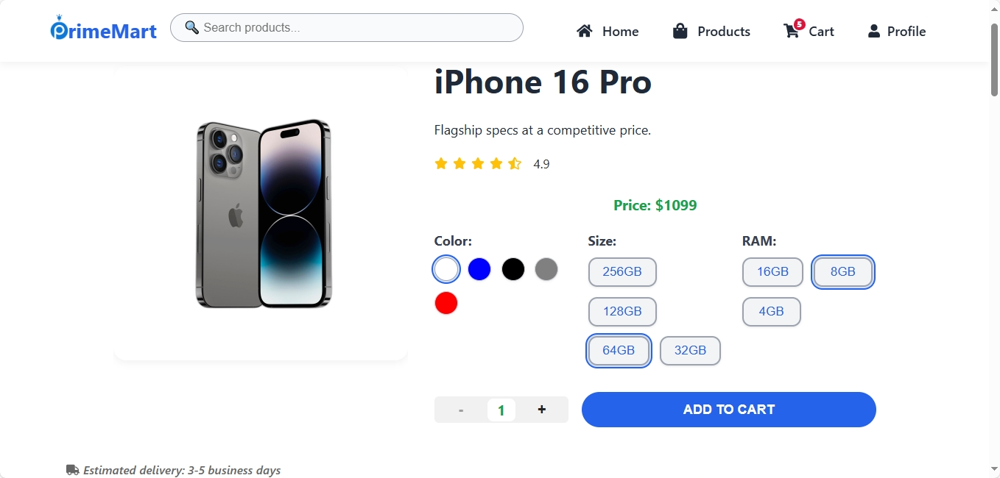

# 🛍️ PrimeMart — Modern Ecommerce App

Welcome to **PrimeMart**, a stylish and responsive React e-commerce website built to simulate a full online shopping experience.

---

## 🚀 Features

- ✅ Home page with featured categories
- ✅ Subcategory navigation
- ✅ Product quick view popups
- ✅ Real-time price changes by RAM & storage
- ✅ Add to cart from detail or quick view
- ✅ Cart with increase/decrease/delete
- ✅ Cart badge that syncs everywhere
- ✅ User login/profile (Firebase)
- ✅ Lazy image loading
- ✅ Search & filters (price/category)

---

## 🎯 Tech Stack

- **React** + **React Router**
- **Firebase Auth + Firestore**
- **CSS** (custom, no frameworks)
- **LocalStorage** (for persistent cart)
- **React Icons**

---

## 🎥 Live Demo (Full Walkthrough)

> 📽️ Watch the full video walkthrough on **Fiverr**:  
> _(You can message me directly to view it)_

---

## 🧪 How to Run It Locally

git clone https://github.com/Mousacr7/primemart.git
cd primemart
npm install
npm start
👨‍💻 Author
Musa Mlam Al Brnawi
Frontend Developer — React, Firebase, Web Design
📫 https://www.fiverr.com/s/yvaRpbb
🔖 Note for Clients
This project demonstrates my ability to build full e-commerce systems with modern design, custom logic, and a clean user experience.

Available for freelance work on [!Fiverr](https://www.fiverr.com/s/yvaRpbb)/ [!Upwork.](https://www.upwork.com/freelancers/~01fc5fdd695c924d11)

📃 License
Free to use for educational or portfolio purposes.